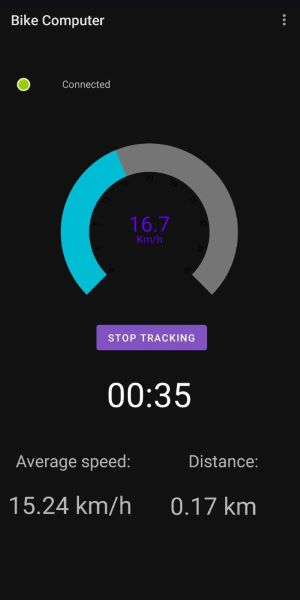
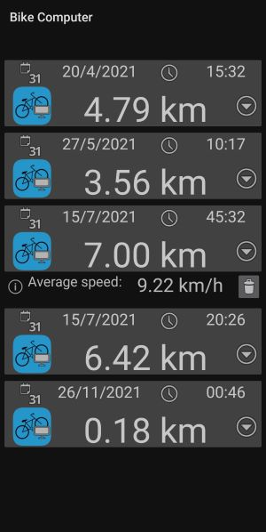

# Android application for BLE32 based bike computer

Android app that allows you to use [ESP32 Bike computer](https://github.com/AlexeiTrofimov/Bike-Computer).
Functionality includes showing of real time speed, average speed, travelled distance and duration of you trip.
Past trips are also stored in internal database.

## Installation

Copy repo to your computer

Open project with Android Studio and connect your phone to your computer.

Install apk to your phone.

## Usage
After you've installed apk on your phone, go to settings and set diameter of your bikes wheel. If this value is not set, app will prompt you to do so before you can start the trip.

After that, turn on scan from drop down menu. Before first first scan, app will ask you to access phone's location.
**Tracking of the location is only required, because usage of BLE on Android demands it. Your actual location is not tracked and e.g. travelled distance is calculated usind data sent from ESP32.**

Wait until phone has connected to bike computer. Once connection status indicator has turned green, app is ready to use. 

You can start trip by pressing ***Start tracking***-button. When you've finished your trip, press ***Stop tracking***-button and your trip will end and will be saved to database.

